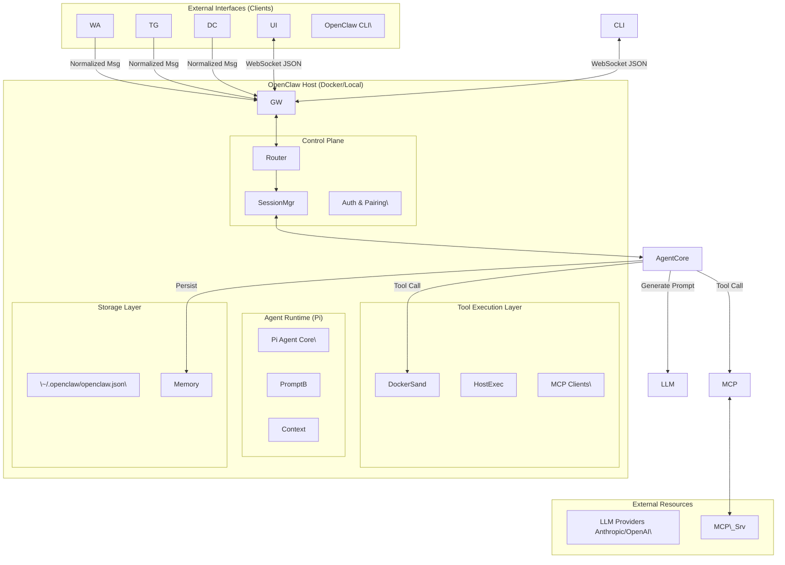

# **OpenCLAW 專案技術評估與架構分析報告**

**版本:** 1.0

**日期:** 2026-02-01

**分析對象:** OpenClaw (原 MoltBot/ClawdBot) v2026.x

---

**1\. 系統架構解構 (Architecture View)**

OpenClaw 採用「閘道器中心 (Gateway-Centric)」的微服務化單體架構。與傳統 SaaS AI 不同，它將控制權完全下放至本地端，透過一個核心 Gateway 協調通訊、Agent 邏輯與工具執行。

### **1.1 核心架構圖 (Conceptual Diagram)**

程式碼片段



### **1.2 關鍵組件資料流**

1. **訊息接入 (Ingress):** 外部訊息（如 Telegram）由 Adapter 接收並正規化為標準 Envelope 格式，注入 Gateway 的 Event Loop 1。  
2. **路由與會話 (Routing):** Gateway 根據 sessionId（通常是 channel:sender\_id）鎖定會話，並調用 Pi Agent。  
3. **推論與執行 (Inference & Execution):** Agent 建構包含系統提示詞、工具定義與歷史上下文的 Prompt，發送至 LLM。若 LLM 回傳工具調用請求（Tool Call），Gateway 會攔截並分派至 Docker 沙箱或 MCP Client 執行 3。  
4. **MCP 整合:** 透過 stdio 或 SSE 協議，Gateway 動態掛載外部 MCP Server，使其能力成為 Agent 可用的工具 5。

---

**2\. 功能驗證手冊 (Function & Verification)**

本章節提供 POC 階段的可測試項目與驗證步驟。

### **2.1 核心功能測試表**

| 功能模組 | 測試項目 | 預期結果 | 驗證指令/步驟 |
| :---- | :---- | :---- | :---- |
| **通訊** | **配對機制 (Pairing)** | 首次私訊應收到 6 位數驗證碼，直到後台核准。 | 1\. TG 私訊 Bot。 2\. CLI: openclaw pairing list 3\. CLI: openclaw pairing approve telegram \<code\> 6 |
| **通訊** | **跨平台訊息路由** | 訊息應能從 TG 進，並正確觸發 Agent 回覆至 TG。 | 發送 "Hello"，確認回覆未被錯誤路由至 WebChat (參見 Issue \#5248)。 |
| **工具** | **沙箱檔案操作** | Agent 能建立檔案，但無法存取宿主機敏感目錄。 | 指令：「在當前目錄建立 test.txt 寫入當前時間」。 指令：「讀取 /etc/shadow」(應失敗)。 |
| **記憶** | **跨 Session 記憶** | 重啟服務後，Agent 仍記得先前對話的關鍵資訊。 | 1\. 告知：「我的專案代號是 Alpha」。 2\. docker restart 3\. 詢問：「我的專案代號是什麼？」 |
| **擴充** | **MCP 工具掛載** | Agent 能使用未經修改的外部 MCP Server 工具。 | 配置 sqlite-mcp，詢問：「建立一個 users 資料表」。 |

---

**3\. 部署與配置手冊 (Deployment & Configuration)**

### **3.1 關鍵環境變數 (.env)**

在 POC 階段，建議將這些參數寫入 .env 並透過 Docker Compose 注入，而非直接修改 openclaw.json。

```Bash
\# \=== 核心與安全 \===  
\# Gateway 的存取令牌，若需遠端連線 (Web UI) 必填  
OPENCLAW\_GATEWAY\_TOKEN=sk\_your\_secure\_token\_here  
\# 設定日誌級別，POC 階段建議 debug 以排查問題  
LOG\_LEVEL=debug

\# \=== 模型供應商 (擇一或並存) \===  
\# Anthropic (建議使用，支援度最佳)  
ANTHROPIC\_API\_KEY=sk-ant-api03-...  
\# OpenAI (備用)  
OPENAI\_API\_KEY=sk-proj-...

\# \=== 模型指定 \===  
\# 鎖定模型版本以確保測試一致性  
DEFAULT\_MODEL=claude-3-5-sonnet-20240620
```

### **3.2 簡化版 Docker Compose (POC 專用)**

此配置移除了複雜的網路設定，專注於快速啟動與除錯。

```YAML
services:  
  openclaw:  
    \# 建議鎖定具體 digest 或 tag，避免 latest 版本浮動導致的不穩定  
    image: openclaw/gateway:latest
    container\_name: openclaw\_poc  
    restart: unless-stopped  
    \# 網路模式：host 模式最簡單，避免 Docker 內部網路路由問題 (Linux 適用)  
    \# macOS/Windows 需改用 ports 映射  
    network\_mode: host
    environment:  
      \- NODE\_ENV=development  
      \- TZ=Asia/Taipei \# 確保 Agent 時間感知正確  
    env\_file:  
      \-.env  
    volumes:  
      \-./config:/root/.openclaw \# 設定檔持久化  
      \-./sessions:/root/.openclaw/sessions \# 對話紀錄持久化  
      \# ⚠️ 危險：掛載 Docker Socket 允許 Agent 啟動兄弟容器 (沙箱功能必需)  
      \- /var/run/docker.sock:/var/run/docker.sock
```

### **3.3 常見報錯排除 (Troubleshooting)**

1. **Error: bind EADDRINUSE :::18789**  
   * **原因:** 舊版服務 (可能名為 clawdbot) 未完全停止，或容器與宿主機端口衝突。  
   * **解法:** docker stop $(docker ps \-q) 確保乾淨，或使用 lsof \-i :18789 檢查佔用進程 。  
2. **Authentication Failed (401)**  
   * **原因:** 前端 Web UI 保存的 Token 與後端 .env 不一致。  
   * **解法:** 清除瀏覽器 LocalStorage，或在 openclaw.json 中暫時將 auth.enabled 設為 false (僅限內網測試) 8。

---

**4\. 開發者指南 (Developer Guide)**

### **4.1 核心邏輯路徑導讀**

進行二次開發前，需熟悉以下關鍵路徑：

* **Agent 提示詞構建 (System Prompt):**  
  * 路徑: src/agents/prompt-builder.ts (推測) 或 src/agents/pi/  
  * 說明: 此處定義了 Agent 如何「認知」自己 (You are OpenClaw...) 以及如何解析工具回傳的結果 9。  
* **工具調用處理 (Tool Execution):**  
  * 路徑: src/agents/sandbox.ts 與 src/tools/  
  * 說明: 定義了哪些工具直接在 Node.js 進程執行，哪些被轉發至 Docker 容器 3。  
* **訊息路由 (Routing):**  
  * 路徑: src/gateway/server.ts 或 src/routing/  
  * 說明: 處理 channelId \-\> sessionId 的映射邏輯。

### **4.2 擴充指南：新增自定義 Messenger**

若要將公司內部通訊軟體 (例: CorpChat) 整合至 OpenClaw，需開發一個 **Channel Extension**。

**步驟 1: 建立插件目錄**

在 extensions/corp-chat/ 下建立專案。

**步驟 2: 實作 Channel Provider 介面**

需參考 src/channels/ 中的介面定義 (通常包含 connect, send, disconnect)。

```TypeScript
// extensions/corp-chat/src/index.ts (概念代碼)  
export default class CorpChatProvider {  
  constructor(api) { this.api \= api; }

  async connect() {  
    // 1\. 連接公司內部 WebSocket  
    this.ws \= new InternalChatWS(this.config.token);  

    // 2\. 監聽訊息並轉發給 Gateway  
    this.ws.on('message', (msg) \=\> {  
      this.api.ingress.dispatch({  
        id: msg.id,  
        text: msg.content,  
        sender: { id: msg.userId, name: msg.userName },  
        channel: 'corp-chat', // 識別字串  
        raw: msg  
      });  
    });  
  }

  async send(target, text) {  
    // 3\. 實作發送邏輯  
    await this.ws.send(target, text);  
  }  
}
```

**步驟 3: 註冊插件**

修改根目錄 package.json 或 openclaw.json，將新插件加入載入列表 。

---

**5\. API 與介面定義**

### **5.1 Gateway WebSocket Protocol**

Gateway 與前端/CLI 的通訊基於 JSON 訊息流。

* **Endpoint:** ws://\<host\>:18789  
* **Message Format (Client \-\> Server):**  
  ```JSON  
  {  
    "type": "chat.send",  
    "id": "req\_unique\_id",  
    "payload": {  
      "sessionId": "agent:main:telegram:12345",  
      "content": "幫我查詢伺服器狀態"  
    }  
  }
  ```  

* **Message Format (Server \-\> Client):**  
  ```JSON  
  {  
    "type": "chat.message",  // 或者是 agent.thought (思考過程)  
    "payload": {  
      "text": "正在執行 uptime 指令...",  
      "toolCalls": \[{"name": "exec", "args": \["uptime"\]}\]  
    }  
  }
  ```

### **5.2 Agent 介面規範**

所有 Agent 必須具備以下能力才能被 Gateway 納管：

1. **Stateless/Stateful:** 支援透過 sessionId 恢復上下文。  
2. **Streamable:** 必須支援串流輸出 (Streaming response)，以便即時回饋給 IM 客戶端。

---

**6\. 專案 Issue 與 Release 分析 (2026.01 現狀)**

### **6.1 當前嚴重 Bug/Issue 列表**

根據 GitHub Issues 分析，目前有幾個高風險問題需注意：

1. **Telegram 回覆路由失效 (Issue \#5248):** 8  
   * **現象:** 用戶在 Telegram 發送訊息，Gateway 收到並處理，但 Agent 的回覆被錯誤路由至 WebChat 通道，導致 Telegram 端無回應。  
   * **影響:** 嚴重影響 POC 體驗，建議暫時使用 CLI 或 WebUI 進行驗證，或等待修復 Patch。  
2. **Slack 記憶體洩漏 (Issue \#5258):** 10  
   * **現象:** Slack 整合模組中的 Thread Cache 無限增長。  
   * **影響:** 長期運行的 Docker 容器會因 OOM (Out of Memory) 崩潰。  
3. **版本升級衝突 (Issue \#5103):**  
   * **現象:** 從 clawdbot 升級至 openclaw 時，舊服務未停止，導致端口 18789 衝突，新服務進入重啟迴圈。  
   * **對策:** 部署前務必執行 pkill \-f clawdbot 並手動清理舊的 systemd service 檔案。

### **6.2 安全性風險 (Security Advisory)**

* **Localhost Spoofing:** Gateway 預設信任 127.0.0.1。若 Nginx 反向代理配置不當 (未傳遞真實 IP)，外部攻擊者可偽裝成本地用戶繞過驗證，取得 Shell 執行權限 11。  
* **防禦建議:** 在生產環境中，務必強制開啟 Token 驗證，並在 Nginx 設定 proxy\_set\_header X-Forwarded-For $remote\_addr。

---

**引用的著作**

1. OpenClaw: Index, 檢索日期：1月 31, 2026， [https://docs.openclaw.ai/](https://docs.openclaw.ai/)  
2. openclaw/AGENTS.md at main · openclaw/openclaw · GitHub, 檢索日期：1月 31, 2026， [https://github.com/openclaw/openclaw/blob/main/AGENTS.md](https://github.com/openclaw/openclaw/blob/main/AGENTS.md)  
3. How to Run OpenClaw with DigitalOcean's One-Click Deploy, 檢索日期：1月 31, 2026， [https://www.digitalocean.com/community/tutorials/how-to-run-openclaw](https://www.digitalocean.com/community/tutorials/how-to-run-openclaw)  
4. Feature: Native MCP (Model Context Protocol) support · Issue \#4834 \- GitHub, 檢索日期：1月 31, 2026， [https://github.com/openclaw/openclaw/issues/4834](https://github.com/openclaw/openclaw/issues/4834)  
5. What is the Model Context Protocol (MCP)? \- Model Context Protocol, 檢索日期：1月 31, 2026， [https://modelcontextprotocol.io/](https://modelcontextprotocol.io/)  
6. openclaw/openclaw: Your own personal AI assistant. Any OS. Any Platform. The lobster way. \- GitHub, 檢索日期：1月 31, 2026， [https://github.com/openclaw/openclaw](https://github.com/openclaw/openclaw)  
7. Whatsapp \- OpenClaw, 檢索日期：1月 31, 2026， [https://docs.molt.bot/channels/whatsapp](https://docs.molt.bot/channels/whatsapp)  
8. Bug Report: Telegram Messages Don't Route Responses Back to Telegram \#5248 \- GitHub, 檢索日期：1月 31, 2026， [https://github.com/openclaw/openclaw/issues/5248](https://github.com/openclaw/openclaw/issues/5248)  
9. Agent Builder | OpenAI API, 檢索日期：1月 31, 2026， [https://platform.openai.com/docs/guides/agent-builder](https://platform.openai.com/docs/guides/agent-builder)  
10. Issues · openclaw/openclaw · GitHub, 檢索日期：1月 31, 2026， [https://github.com/openclaw/openclaw/issues](https://github.com/openclaw/openclaw/issues)  
11. Agency vs. Anarchy: Hardening the OpenClaw AI Frontier \- Penligent, 檢索日期：1月 31, 2026， [https://www.penligent.ai/hackinglabs/ko/agency-vs-anarchy-hardening-the-openclaw-ai-frontier/](https://www.penligent.ai/hackinglabs/ko/agency-vs-anarchy-hardening-the-openclaw-ai-frontier/)
