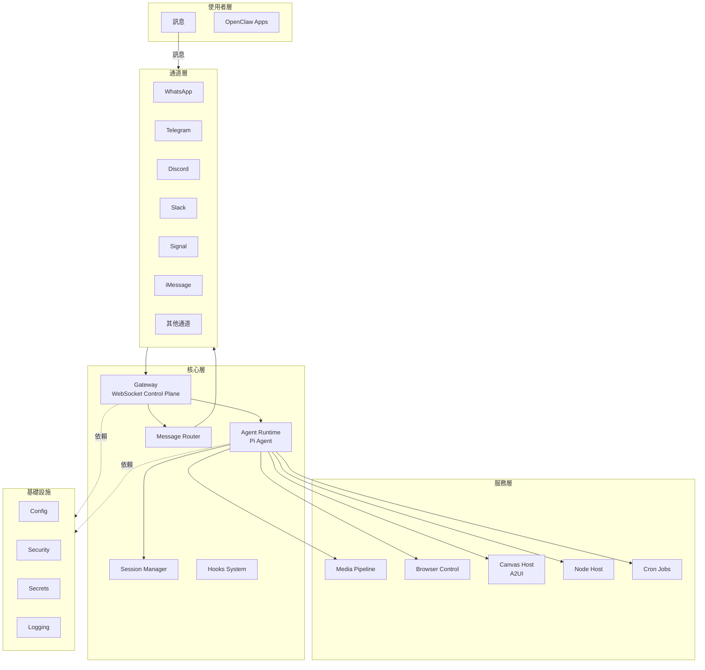
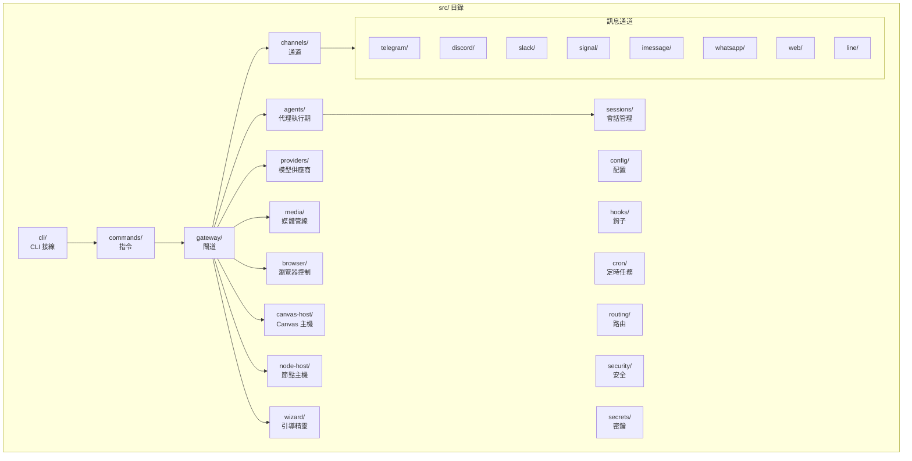
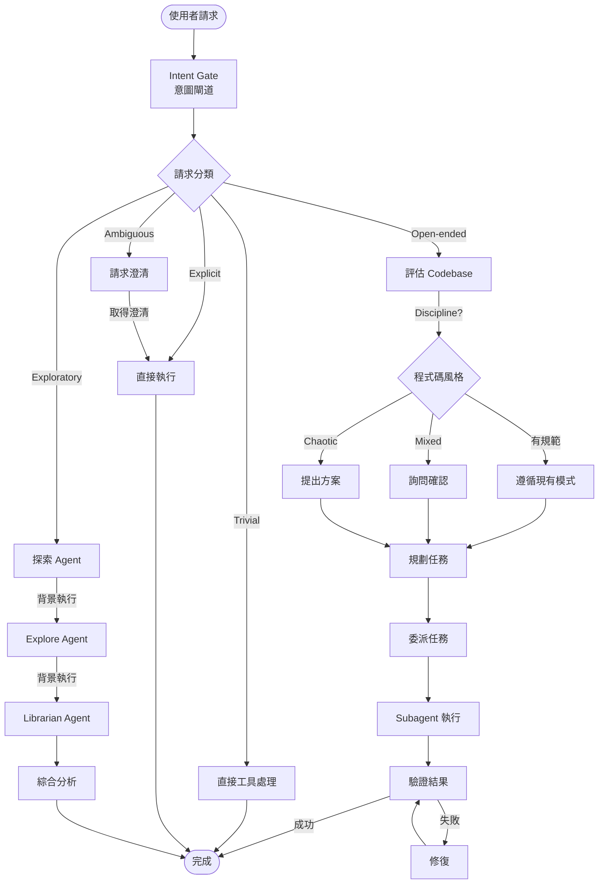
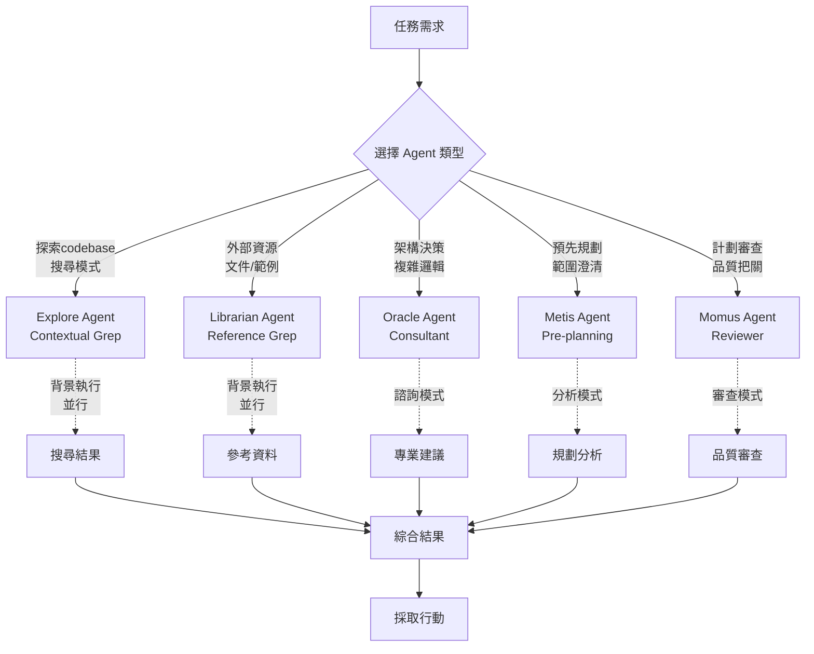
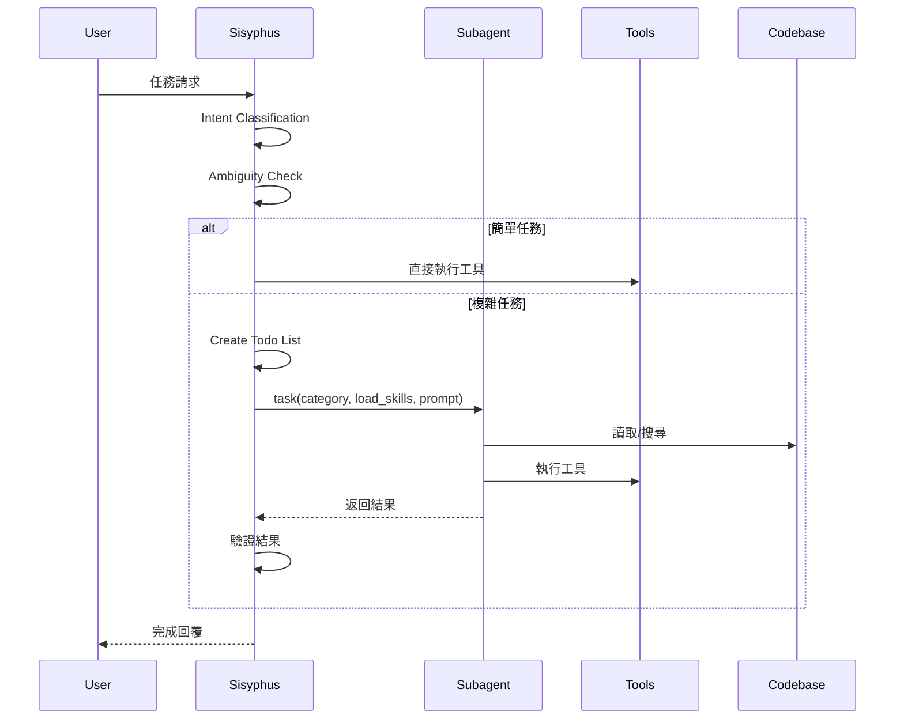
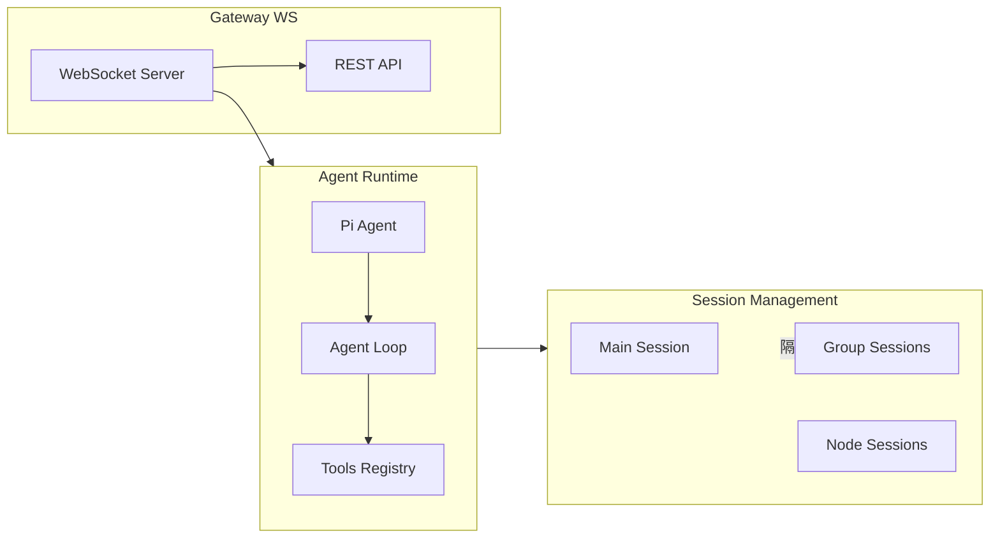
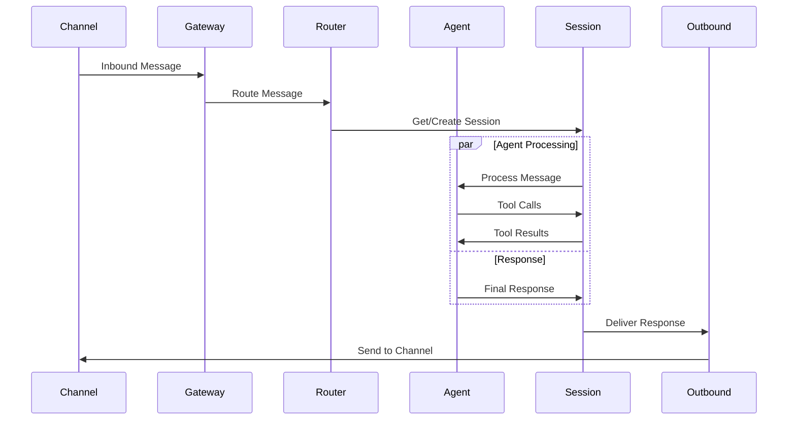
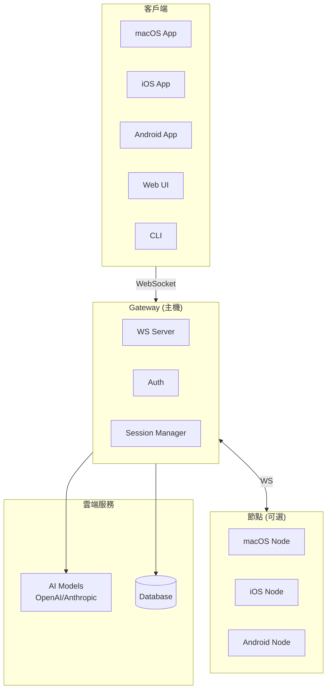

# OpenClaw 專案架構分析

## 1. 專案總覽

**OpenClaw** 是一個多通道 AI 閘道（Multi-channel AI Gateway），支援多種訊息平台的整合，提供 personal AI assistant 功能。

### 核心特性
- 多通道訊息收發（WhatsApp、Telegram、Slack、Discord、Signal、iMessage 等）
- Gateway WebSocket 控制平面
- AI Agent 執行期（Pi agent runtime）
- 瀏覽器控制與 Canvas 渲染
- 跨平台支援（macOS、iOS、Android、Linux）

---

## 2. 專案架構圖

### 2.1 整體架構



### 2.2 Source Code 結構



---

## 3. Agent 系統架構

### 3.1 Agent 工作流程

根據 `AGENTS.md` 中的規範，OpenClaw 專案使用 Sisyphus Agent 系統進行任務處理：



### 3.2 Intent 分類流程

```mermaid
flowchart LR
    INPUT[使用者輸入] --> ANALYZE
    
    ANALYZE -->|"explain X"<br/>"how does Y work"| RESEARCH[Research/理解]
    ANALYZE -->|"implement X"<br/>"add Y"<br/>"create Z"| IMP[Implementation<br/>實作]
    ANALYZE -->|"look into X"<br/>"check Y"<br/>"investigate"| INVEST[Investigation<br/>調查]
    ANALYZE -->|"what do you think"| EVAL[Evaluation<br/>評估]
    ANALYZE -->|"I'm seeing error X"<br/>"Y is broken"| FIX[Fix Needed<br/>修復]
    ANALYZE -->|"refactor"<br/>"improve"<br/>"clean up"| OPEN[Open-ended<br/>開放式]
    
    RESEARCH --> R_ROUTE[explore/librarian<br/>→ synthesize → answer]
    IMP --> I_ROUTE[plan → delegate<br/>or execute]
    INVEST --> INV_ROUTE[explore →<br/>report findings]
    EVAL --> E_ROUTE[evaluate → propose<br/>→ wait confirmation]
    FIX --> F_ROUTE[diagnose → fix<br/>minimally]
    OPEN --> O_ROUTE[assess codebase<br/>→ propose approach]
```

### 3.3 Subagent 類型與使用情境



### 3.4 Task 委派模式



---

## 4. 模組詳細說明

### 4.1 訊息通道 (Messaging Channels)

| 目錄 | 說明 | 技術堆疊 |
|------|------|----------|
| `telegram/` | Telegram Bot | grammY |
| `discord/` | Discord Bot | discord.js |
| `slack/` | Slack Bot | @slack/bolt |
| `signal/` | Signal | signal-cli |
| `whatsapp/` | WhatsApp Web | Baileys |
| `web/` | WhatsApp (另一實現) | Baileys |
| `imessage/` | iMessage (Legacy) | imsg |
| `line/` | LINE Bot | @line/bot-sdk |

### 4.2 核心服務 (Core Services)



### 4.3 工具系統 (Tools System)

OpenClaw 提供了豐富的內建工具：

- **Browser Control**: 瀏覽器自動化
- **Canvas**: A2UI 視覺化工作區
- **Nodes**: 裝置節點控制（相機、螢幕錄影、位置等）
- **Cron**: 定時任務
- **Sessions**: 跨會話通訊工具

---

## 5. 資料流向

### 5.1 訊息處理流程



---

## 6. 部署架構



---

## 7. 開發與測試

### 7.1 專案組織

```
openclaw/
├── src/                    # 主要原始碼
│   ├── cli/               # CLI 接線
│   ├── commands/          # CLI 指令
│   ├── gateway/           # WebSocket 閘道
│   ├── channels/          # 通道實作
│   ├── agents/            # Agent 執行期
│   ├── sessions/          # 會話管理
│   ├── providers/         # AI 模型供應商
│   └── ...
├── extensions/            # 插件/擴充套件
├── apps/                  # macOS/iOS/Android 應用
├── docs/                  # Mintlify 文件
├── skills/                # 技能套件
├── scripts/               # 腳本
└── test/                  # 測試檔案
```

### 7.2 常用指令

| 指令 | 說明 |
|------|------|
| `pnpm build` | 建置專案 |
| `pnpm test` | 執行測試 |
| `pnpm check` | Lint/Format 檢查 |
| `pnpm gateway:watch` | 開發模式閘道 |
| `pnpm openclaw onboard` | 執行引導精靈 |

---

## 8. 總結

OpenClaw 是一個複雜但結構清晰的多元訊息通道 AI 閘道系統。其核心價值在於：

1. **統一介面**: 透過 Gateway 統一管理多種訊息平台
2. **彈性擴充**: 支援 extensions/plugins 擴充新通道
3. **Agent 驅動**: 使用 Pi Agent Runtime 處理 AI 任務
4. **工具豐富**: 整合瀏覽器控制、Canvas、定時任務等
5. **跨平台**: 支援 macOS、iOS、Android 等多種客戶端

Agent 系統採用 Sisyphus 架構，強調意圖分類、任務委派、並行執行與驗證，確保開發效率與程式碼品質。
