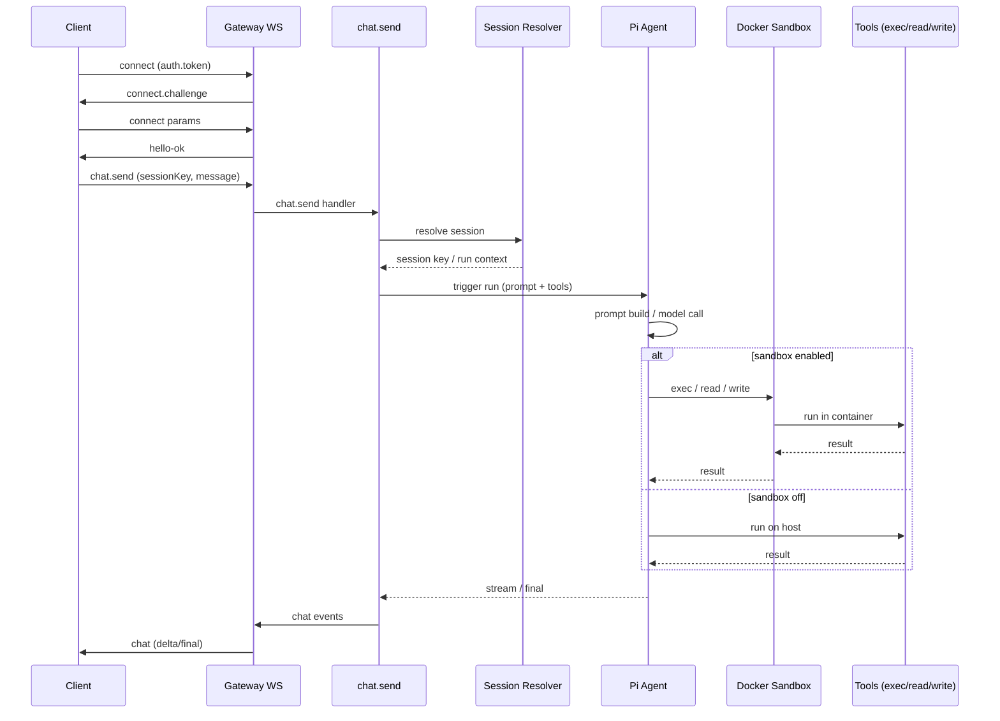
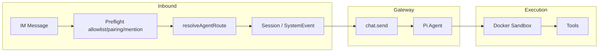

# OpenClaw 企業導入技術評估與實施報告

本報告基於 OpenClaw 程式碼庫與文件審計，針對企業 POC 驗證與二次開發（自訂通訊插件、API 整合）提供技術評估與實施指引。版本參考：v2026.x（openclaw）。

---

## 1. 系統架構解構 (Architecture Deep Dive)

### 1.1 Gateway 中心架構

OpenClaw 以 **Node.js Gateway** 為單一控制面，於預設埠 **18789** 上同時提供 WebSocket 與 HTTP，協調 Pi Agent、Docker Sandbox 與外部通訊軟體。

**入口與埠**

- 入口：`src/gateway/server.impl.ts` 的 `startGatewayServer(port = 18789)`。
- 預設埠常數：`src/config/paths.ts` 的 `DEFAULT_GATEWAY_PORT = 18789`。
- 單一埠上多工：WebSocket（握手與 RPC）、Control UI HTTP、健康檢查等。

**綁定模式**

- `GatewayServerOptions.bind` 支援：`loopback` | `lan` | `tailnet` | `auto`。
- 非 loopback 時 **必須** 設定 auth（token 或 password），否則啟動時拋錯（`src/gateway/server-runtime-config.ts` L89-93）。

**協調元件**

- **WebSocket**：`attachGatewayWsHandlers`（`src/gateway/server-ws-runtime.ts`）→ `src/gateway/server/ws-connection.ts`。握手流程：Gateway 先送 `connect.challenge`，Client 送 `connect` request（含 `params.auth.token` 等），Gateway 回 `hello-ok`。
- **Channel**：`createChannelManager`（`src/gateway/server-channels.ts`），載入 `listChannelPlugins()`（`src/channels/plugins/index.ts`），整合內建與 extension 頻道。
- **Chat / Agent**：`createAgentEventHandler`（`src/gateway/server-chat.ts`），處理 `chat.send`、`chat.abort`、`chat.history` 等。
- **Pi Agent**：embedded runner（`src/agents/pi-embedded-runner/run.ts`）在 Gateway 進程內執行推論與工具調度。
- **Docker Sandbox**：工具執行可選在 Docker 容器內，由 `agents.defaults.sandbox` 控制（`docs/gateway/sandboxing.md`）。

以下序列圖描述從 Client 連線到 `chat.send` 再到工具執行的流程（含 sandbox 分支）。



### 1.2 資料流分析

從「接收 IM 訊息」到「Agent 推論」再到「工具執行」的資料流如下。

**進站（IM → Route）**

- 各 channel 的 monitor（例如 Discord `src/discord/monitor/message-handler.preflight.ts`、Telegram bot、WhatsApp monitor）對每則訊息做 **preflight**：allowlist、pairing、mention、group 政策等。
- 通過後呼叫 `resolveAgentRoute`（`src/routing/resolve-route.ts`），產出 `sessionKey` 與 `route`（agentId、channel 等）。
- 使用者訊息與系統事件經 `enqueueSystemEvent`（`src/infra/system-events.ts`）或 channel 專屬邏輯注入對應 session。

**Gateway 側（chat.send）**

- Client 或 channel 後端透過 WebSocket 呼叫 `chat.send`（`src/gateway/server-methods/chat.ts` L302）。
- 參數含 `sessionKey`、`message`、`idempotencyKey` 等；Gateway 解析 session、觸發 Pi run。

**Pi → 工具**

- Pi 內建 tools（`exec`、`read`、`write`、`edit`、`sessions_*` 等）；若啟用 sandbox，則在 Docker 容器內執行（`docs/gateway/sandboxing.md`），workspace 位於 `~/.openclaw/sandboxes` 或依 `workspaceAccess` 掛載。



### 1.3 MCP 整合說明

**重要結論：OpenClaw Gateway 協定並非 Model Context Protocol (MCP)。**

- Gateway 使用 **自有 WebSocket 協定**（握手、RequestFrame/ResponseFrame/EventFrame），見 `docs/gateway/protocol.md`。
- 專案內 **ACP**（Agent Context Protocol）client（`src/acp/translator.ts`）雖有 `mcpServers` 參數，但實作上 **ignores MCP servers**（L126-127, L156-157）。
- **`openclaw.json` 中沒有「掛載外部 MCP Server」的標準欄位**；MCP 僅見於 `mcporter` skill（外部 MCP CLI）與測試用的 `--mcp-config` 覆寫。

**企業建議**

- 若需接 MCP：需在 Pi/agent 外層或自訂工具中自行橋接 MCP Server；並追蹤官方是否未來提供內建 MCP 掛載。
- 現有擴充點為：Channel 插件、Gateway WebSocket API、Agent tools；可在此之上實作 MCP 橋接。

---

## 2. 部署與配置手冊 (Deployment & Security)

### 2.1 POC 加固 docker-compose

以下為加固版 `docker-compose` 範例，適用 POC 與企業測試環境。

**要點**

- **必填**：`OPENCLAW_GATEWAY_TOKEN`；非 loopback 綁定時 Gateway 強制要求 auth（`src/gateway/server-runtime-config.ts`）。
- **綁定**：POC 若僅本機存取，建議 `--bind loopback`；若需 LAN 存取則用 `lan` 並配合防火牆與 token。
- **卷冊**：僅掛載必要 `OPENCLAW_CONFIG_DIR`、`OPENCLAW_WORKSPACE_DIR`，避免過度掛載宿主目錄。
- **健康檢查**：參考 `docs/install/docker.md`，使用 `openclaw health --token`。

**範例：docker-compose.enterprise-poc.yml**

```yaml
services:
  openclaw-gateway:
    image: ${OPENCLAW_IMAGE:-openclaw:local}
    environment:
      HOME: /home/node
      TERM: xterm-256color
      OPENCLAW_GATEWAY_TOKEN: ${OPENCLAW_GATEWAY_TOKEN}
      CLAUDE_AI_SESSION_KEY: ${CLAUDE_AI_SESSION_KEY:-}
      CLAUDE_WEB_SESSION_KEY: ${CLAUDE_WEB_SESSION_KEY:-}
      CLAUDE_WEB_COOKIE: ${CLAUDE_WEB_COOKIE:-}
    volumes:
      - ${OPENCLAW_CONFIG_DIR}:/home/node/.openclaw
      - ${OPENCLAW_WORKSPACE_DIR}:/home/node/.openclaw/workspace
    ports:
      - "${OPENCLAW_GATEWAY_PORT:-18789}:18789"
      - "${OPENCLAW_BRIDGE_PORT:-18790}:18790"
    init: true
    restart: unless-stopped
    command:
      [
        "node",
        "dist/index.mjs",
        "gateway",
        "--bind",
        "${OPENCLAW_GATEWAY_BIND:-loopback}",
        "--port",
        "18789"
      ]
    healthcheck:
      test: ["CMD", "node", "dist/index.mjs", "health", "--token", "${OPENCLAW_GATEWAY_TOKEN}"]
      interval: 30s
      timeout: 10s
      retries: 3
      start_period: 15s

  openclaw-cli:
    image: ${OPENCLAW_IMAGE:-openclaw:local}
    environment:
      HOME: /home/node
      TERM: xterm-256color
      BROWSER: echo
      OPENCLAW_GATEWAY_TOKEN: ${OPENCLAW_GATEWAY_TOKEN}
      CLAUDE_AI_SESSION_KEY: ${CLAUDE_AI_SESSION_KEY:-}
      CLAUDE_WEB_SESSION_KEY: ${CLAUDE_WEB_SESSION_KEY:-}
      CLAUDE_WEB_COOKIE: ${CLAUDE_WEB_COOKIE:-}
    volumes:
      - ${OPENCLAW_CONFIG_DIR}:/home/node/.openclaw
      - ${OPENCLAW_WORKSPACE_DIR}:/home/node/.openclaw/workspace
    stdin_open: true
    tty: true
    init: true
    entrypoint: ["node", "dist/index.mjs"]
```

**`.env` 建議（POC）**

- `OPENCLAW_GATEWAY_TOKEN`：必填，建議 `openssl rand -hex 32` 產生。
- `OPENCLAW_GATEWAY_BIND`：本機僅用 `loopback`；需 LAN 時設 `lan` 並確保防火牆與 token 已設。
- `OPENCLAW_CONFIG_DIR`、`OPENCLAW_WORKSPACE_DIR`：指向宿主目錄，確保重啟後配置與工作區持久化。

### 2.2 Localhost Spoofing（反向代理繞過驗證）

當 Gateway 置於 **Nginx（或 Caddy、Traefik）等反向代理** 後方時，若未正確設定，攻擊者可透過偽造 `X-Forwarded-For` 讓連線被視為「本機」而繞過驗證。

**官方機制**（`docs/gateway/security/index.md` L86-99）

- `gateway.trustedProxies` 列出可信任的 proxy IP。
- 僅當請求來自 **trustedProxies** 所列 IP 時，Gateway 才依 `X-Forwarded-For` / `X-Real-IP` 判斷真實 client IP（含「是否為 local client」）。
- 若 proxy 未在 trust list，**不會**將連線視為 local client，可避免未授權即被當成本機信任。

**Nginx 建議**

- 由 proxy **覆寫**（不要追加）`X-Forwarded-For`，避免 client 自行帶入偽造值。
- 僅信任 proxy 自身 IP（例如 `127.0.0.1` 或實際 proxy 機器的 IP）。

範例（僅說明概念，實際 host/port 請依環境調整）：

```nginx
location / {
    proxy_pass http://127.0.0.1:18789;
    proxy_http_version 1.1;
    proxy_set_header Upgrade $http_upgrade;
    proxy_set_header Connection "upgrade";
    proxy_set_header Host $host;
    proxy_set_header X-Real-IP $remote_addr;
    proxy_set_header X-Forwarded-For $remote_addr;
    proxy_set_header X-Forwarded-Proto $scheme;
}
```

**openclaw 設定**

- 在 `openclaw.json`（或等同配置）中設定：

```json5
{
  gateway: {
    trustedProxies: ["127.0.0.1"],
    auth: { mode: "token", token: "YOUR_TOKEN" }
  }
}
```

- 或透過環境變數 `OPENCLAW_GATEWAY_TOKEN` 提供 token；**務必**啟用 auth，不可僅依賴「本機」判斷。

**審計提醒**：`openclaw security audit` 在 `bind === "loopback"` 且 Control UI 啟用且 `trustedProxies` 為空時會告警（`src/security/audit.ts` L286-297），建議設定 `trustedProxies` 或僅本機存取。

### 2.3 環境變數詳解

下表列出影響模型切換、權限與部署的關鍵參數（依程式與文件整理）。

| 變數名 | 用途 | 預設 | 企業注意事項 |
| ------ | ---- | ---- | ------------- |
| `OPENCLAW_GATEWAY_TOKEN` | Gateway WebSocket/HTTP 認證（token 模式） | 無 | **敏感**；非 loopback 時必填；建議隨機產生 |
| `OPENCLAW_GATEWAY_PASSWORD` | Gateway 密碼認證（password 模式） | 無 | **敏感**；可與 token 二擇一 |
| `OPENCLAW_GATEWAY_PORT` | Gateway 監聽埠 | 18789 | 與 `gateway.port` / `--port` 一致 |
| `OPENCLAW_STATE_DIR` | 狀態目錄（sessions、credentials 等） | `~/.openclaw` | 企業可指向專用磁碟或卷冊 |
| `CLAWDBOT_STATE_DIR` | 舊版 state 覆寫（相容） | 無 | 升級後建議統一用 `OPENCLAW_STATE_DIR` |
| `OPENCLAW_CONFIG_DIR` | Docker 掛載之配置目錄 | 常由 compose 傳入 | 需含 `openclaw.json` 及 credentials |
| `OPENCLAW_WORKSPACE_DIR` | Docker 掛載之工作區 | 常由 compose 傳入 | 依需求掛載 |
| `OPENCLAW_GATEWAY_BIND` | Docker 內 `--bind` 參數 | 原 compose 預設 `lan` | POC 建議 `loopback`；對外需 token + 防火牆 |

**模型與 API 金鑰**

- 模型選擇由 **`openclaw.json`** 的 `agents.defaults.model`、`models.providers` 控制，非單一環境變數。
- API 金鑰多經 onboarding 寫入 `~/.openclaw/agents/<agentId>/agent/auth-profiles.json` 或 config；少數 provider 支援環境變數（如 `ANTHROPIC_API_KEY`），請參照各 provider 文件。

---

## 3. 功能驗證手冊 (Verification Plan)

以下 5 則測試案例用於驗證 POC 的配對、記憶持久化、沙箱隔離、Gateway 認證與 chat 端到端。

### 3.1 配對機制 (Pairing)

**目的**：確認 Telegram/WhatsApp 首次 DM 可觸發配對流程，並經核准後正常與 Agent 對話。

**前置條件**

- Gateway 已啟動；對應 channel（telegram 或 whatsapp）已設定且 `dmPolicy` 為 `pairing`（預設）。
- 使用一組尚未核准的帳號/電話發送 DM。

**步驟**

1. 以新帳號向 Bot 發送 DM。
2. 預期 Bot 回覆一組 **8 字元配對碼**（大寫、無 0O1I）；若未收到，檢查 channel 連線與 `openclaw pairing list <channel>` 是否有 pending。
3. 在 Gateway 主機或已掛載 config 的環境執行：
   - `openclaw pairing list telegram`（或 `whatsapp`）
   - `openclaw pairing approve telegram <CODE>`（或 whatsapp + code）
4. 核准後，同一帳號再發一則 DM。

**預期**

- 核准後該 peer 可正常觸發 Agent 回覆。
- 狀態檔：`~/.openclaw/credentials/<channel>-pairing.json`（pending）、`~/.openclaw/credentials/<channel>-allowFrom.json`（已核准）。

**參考**：`docs/start/pairing.md`。

### 3.2 記憶持久化

**目的**：驗證 Agent 在重啟容器後仍能引用同一 session 的先前對話（session transcript 持久化）。

**前置條件**

- 單一 session 已存在（例如已配對的 DM 或 WebChat 的 sessionKey）。

**步驟**

1. 在該 session 送數則訊息並取得 Agent 回覆。
2. 重啟 Gateway 容器（`docker compose restart openclaw-gateway`）。
3. 待 Gateway 健康後，以 **同一 session** 再送一則訊息（例如延續前文）。

**預期**

- Agent 回覆能引用先前對話內容；session 與 transcript 位於 `~/.openclaw/agents/<agentId>/sessions/`（`sessions.json` 與 `*.jsonl`）。
- 若啟用 extension `memory-lancedb`，可額外驗證長期記憶是否被引用。

**驗證指令（可選）**

- 檢查目錄：`ls -la ~/.openclaw/agents/main/sessions/`（路徑依 agentId 與 `OPENCLAW_STATE_DIR` 調整）。

### 3.3 沙箱隔離

**目的**：確認啟用 sandbox 時，Agent 無法讀取宿主機敏感檔案。

**前置條件**

- `agents.defaults.sandbox.mode` 設為 `all` 或 `non-main`（且測試 session 為 non-main 或對應 agent）。
- Sandbox 未透過 `docker.binds` 掛載宿主敏感路徑。

**步驟**

1. 在 session 中要求 Agent 讀取宿主機檔案，例如：
   - `/etc/passwd`
   - 或 `~/.ssh/id_rsa`（或任一宿主專屬路徑）
2. 觀察 Agent 回應（或工具回報錯誤）。

**預期**

- Sandbox 內未掛載上述路徑時，應 **無法** 讀取；或僅能讀到 sandbox 內 workspace（如 `~/.openclaw/sandboxes` 下對應目錄）。
- 若為 `workspaceAccess: "none"`（預設），agent workspace 不掛載進容器，僅 sandbox workspace 可見。

**參考**：`docs/gateway/sandboxing.md`。

### 3.4 Gateway 認證

**目的**：驗證 WebSocket 握手需提供正確 token，未帶 token 會被拒絕。

**步驟**

1. 使用 WebSocket 客戶端連線至 `ws://<host>:18789`，**不**在 `connect` 的 `params.auth` 中帶 `token`。
2. 預期：連線被拒絕或收到錯誤回應。
3. 再次連線，在第一次 `connect` request 的 `params` 中帶 `auth: { token: "<OPENCLAW_GATEWAY_TOKEN>" }`。
4. 預期：收到 `type: "res", ok: true` 且 payload 含 `hello-ok`。

**參考**：`docs/gateway/protocol.md`。

### 3.5 chat.send 端到端

**目的**：驗證透過 WebSocket 呼叫 `chat.send` 能觸發 Agent 並收到串流或完成事件。

**前置條件**

- 已握手成功（見 3.4）；具備有效 `sessionKey`（例如從 `sessions.list` 取得或從 WebChat 取得）。

**步驟**

1. 送出一筆 request：`{ "type": "req", "id": "<uuid>", "method": "chat.send", "params": { "sessionKey": "<key>", "message": "Hello", "idempotencyKey": "<uuid>" } }`。
2. 預期：先後收到 `chat` 事件（如 `delta`）與最終完成或錯誤。

**預期**

- 行為與 `src/gateway/server-methods/chat.ts` 及 e2e 測試一致；若 session 有效，應有串流或 final 事件。

**chat.send 參數**（`src/gateway/protocol/schema/logs-chat.ts`）：`sessionKey`（必填）、`message`（必填）、`idempotencyKey`（必填）、`thinking`、`deliver`、`attachments`、`timeoutMs` 可選。

---

## 4. 二次開發指南：擴充與整合

### 4.1 新增自定義 Messenger（Channel 插件）

OpenClaw 以 **ChannelPlugin** 介面擴充通訊管道；需在 **extensions/** 下建立獨立套件，實作 config、outbound、pairing 等 adapter，將外部訊息正規化為統一 route/sessionKey 與內容，並將回覆經 outbound 送回原平台。

**目錄與檔案結構（以 extensions 為準）**

- **目錄**：`extensions/<channelId>/`（例如參考 `extensions/msteams`）。
- **必要檔案**：
  - `openclaw.plugin.json`：`id`、`channels` 陣列、`configSchema`（見 `extensions/msteams/openclaw.plugin.json`）。
  - `package.json`：runtime 依賴放 `dependencies`，勿在 dependencies 使用 `workspace:*`（AGENTS.md）；可將 `openclaw` 放在 devDependencies/peerDependencies。
  - `src/index.ts`：export monitor、probe、send 等（見 `extensions/msteams/src/index.ts`）。
  - `src/channel.ts`：匯出實作 `ChannelPlugin<ResolvedAccount>` 的物件（見 `extensions/msteams/src/channel.ts`）。
- **常備模組**：`runtime.ts`（註冊/啟動）、`monitor.ts`（收訊息）、`send.ts`（發送）、`onboarding.ts`、`probe.ts`（狀態偵測）。

**ChannelPlugin 介面（核心對應）**

專案使用 **ChannelPlugin**（`src/channels/plugins/types.plugin.ts`），而非「ChannelProvider」。對應「連線 / 發送 / 斷線」的為：

- **config**：`ChannelConfigAdapter`（`src/channels/plugins/types.adapters.ts`）— `listAccountIds`、`resolveAccount`、`resolveAllowFrom` 等，決定帳號與 allowlist。
- **outbound**：`ChannelOutboundAdapter` — `deliveryMode`（`direct` | `gateway` | `hybrid`）、`resolveTarget`、以及實際發送邏輯（對應「send」）；將 Gateway 的 `ReplyPayload` 轉成各平台 API 呼叫。
- **pairing**：`ChannelPairingAdapter` — `idLabel`、`normalizeAllowEntry`、`notifyApproval`，用於 DM 配對核准後通知使用者。

插件由 `loadChannelPlugin`（`src/channels/plugins/load.ts`）載入，並透過 dock（`src/channels/dock.ts`）整合進 Gateway。

**Envelope 正規化**

- **進站**：各 channel 的 **monitor** 收到平台原生訊息後，經 allowlist/pairing/mention 檢查，呼叫 `resolveAgentRoute` 產出統一 `sessionKey` 與 `route`，再將訊息與系統事件注入對應 session（或觸發 agent）；此即「正規化為 OpenClaw 內部 envelope」的過程。
- **出站**：Gateway 或 Agent 產出 `ReplyPayload`，透過 channel 的 **outbound** adapter 轉成平台 API（例如 REST、Bot Framework），完成「Envelope → 平台格式」的對應。

### 4.2 Gateway WebSocket 訊息格式（API 介面）

**握手順序**

1. **Gateway → Client**：先送一筆 event frame  
   `{ "type": "event", "event": "connect.challenge", "payload": { "nonce": "<uuid>", "ts": <ms> } }`  
2. **Client → Gateway**：送一筆 request frame，`method: "connect"`，`params` 符合 `ConnectParams`（含 `auth.token` 等）。  
3. **Gateway → Client**：回傳 response frame，`ok: true`，`payload` 含 `type: "hello-ok"`、`protocol`、`server` 等。

**ConnectParams 要點**（`src/gateway/protocol/schema/frames.ts`）

- `minProtocol`、`maxProtocol`：協定版本。
- `client`：`id`、`version`、`platform`、`mode`（如 `operator`、`node`）。
- `auth`：`token` 或 `password`（與 `OPENCLAW_GATEWAY_TOKEN` / password 對應）。
- `role`、`scopes`、`caps`、`commands`、`permissions` 等可選。

**Request / Response 格式**

- **Request**：`{ "type": "req", "id": "<string>", "method": "<method>", "params": { ... } }`  
- **Response**：`{ "type": "res", "id": "<string>", "ok": true|false, "payload": { ... } }` 或帶 `error`。

**常用方法**（`src/gateway/server-methods-list.ts`）

- `chat.send`、`chat.abort`、`chat.history`
- `sessions.list`、`sessions.preview`、`sessions.patch`、`sessions.reset`、`sessions.delete`、`sessions.compact`
- `send`、`agent`、`config.get`、`config.set`、`channels.status`、`health`、`wizard.start`、`wizard.next` 等。

**chat.send 範例**

```json
{
  "type": "req",
  "id": "req-1",
  "method": "chat.send",
  "params": {
    "sessionKey": "agent:main:webchat:dm:xxx",
    "message": "Hello",
    "idempotencyKey": "idem-1"
  }
}
```

- 必填：`sessionKey`、`message`、`idempotencyKey`；可選：`thinking`、`deliver`、`attachments`、`timeoutMs`（見 `src/gateway/protocol/schema/logs-chat.ts`）。

---

## 5. 專案穩定性與風險分析 (Issue & Release Audit)

以下依您提供的 Issue 編號與程式碼/文件整理；**實際狀態與暫時解法請以 GitHub Issues 為準**（建議直接查詢 [openclaw/openclaw](https://github.com/openclaw/openclaw) 對應 issue）。

### 5.1 Telegram 路由失效 (Issue #5248)

- **現象**：訊息無法正確路由回原對話視窗（例如回覆到錯誤的 thread 或 chat）。
- **可能面向**：Telegram 的 `sessionKey` / thread 對應、回覆時的 `reply_into` 或 channel 專屬的「回覆目標」邏輯；或 `resolveAgentRoute` 產出的 key 與 Telegram 對話 ID 不一致。
- **建議**：在 GitHub 搜尋 #5248 查看是否有修復或 workaround（例如特定 config、版號或 branch）；若尚未修復，可暫時依賴其他 channel（如 WebChat）完成 POC，或鎖定已知可用的 Telegram 使用情境。

### 5.2 記憶體洩漏 (Issue #5258) — Slack 模組 / 長連線 OOM

- **現象**：Slack 模組或長連線情境下，Gateway 記憶體持續成長導致 OOM。
- **建議**：監控 Gateway 記憶體與連線數；必要時設定重啟策略（如 cron 或 orchestrator 定期重啟）、或暫時停用 Slack channel 以完成 POC；並追蹤 #5258 是否已有 patch 或建議的 workaround（例如依賴升級、設定上限等）。

### 5.3 升級衝突（ClawdBot → OpenClaw 服務殘留）

- **依據**：`src/config/paths.ts` 的 `LEGACY_STATE_DIRNAMES`（`.clawdbot`、`.moltbot`、`.moldbot`）、`LEGACY_CONFIG_FILENAMES`（`clawdbot.json` 等）；AGENTS.md 建議執行 `openclaw doctor` 處理遷移與殘留。
- **建議**：
  - 升級後執行 `openclaw doctor`，依提示清理或遷移舊 state/config。
  - 確認僅使用單一 state 目錄（`OPENCLAW_STATE_DIR` 或預設 `~/.openclaw`）與單一 config 檔名（`openclaw.json`），避免新舊並存導致行為不一致。
  - 若有舊服務程序仍指向 ClawdBot 目錄，請關閉或改為指向 OpenClaw 目錄後再啟動。

### 5.4 報告撰寫原則（已納入本報告）

- 所有建議以 **企業級落地** 為考量：資安（token、trustedProxies、權限）、穩定性（重啟、資源限制、監控）、可維護性（單一 config、明確 env）。
- 輸出為結構清晰的 Markdown，便於放入 `docs/enterprise/` 或對外交付。

---

## 參考文件與程式路徑

| 主題 | 路徑 |
| ---- | ---- |
| Gateway 啟動與埠 | `src/gateway/server.impl.ts`、`src/config/paths.ts` |
| 綁定與 Auth | `src/gateway/server-runtime-config.ts` |
| WebSocket 握手與協定 | `src/gateway/server/ws-connection.ts`、`docs/gateway/protocol.md` |
| Channel 插件 | `src/channels/plugins/index.ts`、`types.plugin.ts`、`types.adapters.ts` |
| chat.send | `src/gateway/server-methods/chat.ts`、`src/gateway/protocol/schema/logs-chat.ts` |
| 安全與 trustedProxies | `docs/gateway/security/index.md`、`src/security/audit.ts` |
| 配對 | `docs/start/pairing.md`、`src/pairing/pairing-store.ts` |
| Sandbox | `docs/gateway/sandboxing.md`、`docs/install/docker.md` |
| Docker 健康檢查 | `docs/install/docker.md` |
| Extension 範例 | `extensions/msteams/` |

---

*報告產出依據 OpenClaw 程式碼庫與文件審計；若與最新版文件或程式有出入，請以官方 repo 為準。*
