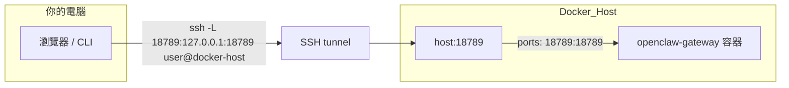

# Docker 遠端存取與 REST API 整合計畫

## 1. Docker 情境下的「user@gateway-host」設定

### 概念

**gateway-host = 跑 Docker 的那台機器（Docker host）**，不是 container 內的使用者或主機名。SSH 與隧道都發生在 **host** 上，不需要在 container 裡安裝或啟用 SSH。




### 設定要點

- **Port mapping**：repo 內 [docker-compose.yml](docker-compose.yml) 已將 host 的 18789 對應到 container 的 18789（`"${OPENCLAW_GATEWAY_PORT:-18789}:18789"`）。從他機連到 **Docker host 的 18789** 就會進到 Gateway。
- **Bind 模式**：[docs/install/docker.md](docs/install/docker.md) 說明 `docker-setup.sh` 預設 `OPENCLAW_GATEWAY_BIND=lan`，讓 container 內綁 `0.0.0.0`，host 的 port publish 才能連到。若設成 `loopback`，文件註明「host-published port access may fail」。
- **SSH 對象**：在**另一台電腦**上執行：

```bash
  ssh -N -L 18789:127.0.0.1:18789 user@docker-host
  

```

- `user`：Docker host 上的 **OS 使用者**（有 SSH 登入權限即可）。
- `docker-host`：跑 `docker compose up` 的那台機器的 hostname 或 IP（若在 VPS 上跑 Docker，即該 VPS 的位址）。
- **不需改 OpenClaw**：不需在 image 或 compose 裡加 SSH；只要 host 可 SSH、port 已 publish，隧道即可用。若 Docker 跑在 VPS，可參考 [Hetzner (Docker VPS)](https://docs.openclaw.ai/install/hetzner)。

### 建議文件補充（可選）

若希望文件明確寫出 Docker 情境，可在 [docs/gateway/remote.md](docs/gateway/remote.md) 或 [docs/install/docker.md](docs/install/docker.md) 加一小節：「當 Gateway 跑在 Docker 時，gateway-host 指 Docker host；SSH 到該 host 並轉發 18789（或你設的 `OPENCLAW_GATEWAY_PORT`）即可，無需在 container 內設定 SSH。」

---

## 2. 其他程式透過 REST API 與 OpenClaw 通訊

### 現有能力（不需改 OpenClaw 即可使用）

OpenClaw 已在**同一 Gateway HTTP port**（預設 18789）上提供多個 REST 介面，其他程式只要能發 HTTP(S) 請求並帶認證即可使用。


| 用途              | 端點                                     | 設定                                                     | 說明                                                                                                         |
| --------------- | -------------------------------------- | ------------------------------------------------------ | ---------------------------------------------------------------------------------------------------------- |
| 類 OpenAI 聊天     | `POST /v1/chat/completions`            | `gateway.http.endpoints.chatCompletions.enabled: true` | [OpenAI Chat Completions](docs/gateway/openai-http-api.md)：Bearer token，支援 stream、agent 選擇、session         |
| 類 OpenResponses | `POST /v1/responses`                   | `gateway.http.endpoints.responses.enabled: true`       | [OpenResponses API](docs/gateway/openresponses-http-api.md)：同上 port、同一套認證                                  |
| 觸發 agent / 喚醒   | `POST /hooks/wake`、`POST /hooks/agent` | `hooks.enabled: true`、`hooks.token`                    | [Webhooks](docs/automation/webhook.md)：Bearer 或 `x-openclaw-token`，可帶 message、agentId、deliver、channel、to 等 |


上述皆與 `openclaw agent` 同一套 agent 執行路徑，權限/路由與 Gateway 一致。

### 其他程式「如何」通訊（無需修改 OpenClaw）

1. **僅要「發訊息給模型並拿回回覆」**
  - 啟用 Chat Completions：在 config 設 `gateway.http.endpoints.chatCompletions.enabled: true`。  
  - 其他程式對 `http(s)://<gateway-host>:<port>/v1/chat/completions` 發 `POST`，Header `Authorization: Bearer <gateway-token>`，Body 為 OpenAI 相容格式（`model`, `messages` 等）。  
  - 若 Gateway 在 Docker 內，**gateway-host** 即 Docker host（或經 SSH tunnel 後的 127.0.0.1），port 為 published 的 18789。
2. **要觸發 agent 並可指定投遞到 channel**
  - 啟用 Hooks：`hooks.enabled: true`、`hooks.token`。  
  - 其他程式 `POST` 到 `http(s)://<gateway-host>:<port>/hooks/agent`（預設 path 或你設的 `hooks.path`），帶 `message`、可選 `agentId`、`deliver`、`channel`、`to` 等（見 [webhook.md](docs/automation/webhook.md)）。
3. **安全**：文件將這些 HTTP 端點視為 **full operator-access**；token 等同於操作者憑證。應只對 loopback / tailnet / 反向代理暴露，不對公網直接開放。

### 何時才需要「修改 OpenClaw」

- **現有端點已滿足需求**：僅需在設定檔啟用對應 endpoint，**無需改程式碼**。
- **需要新的 REST 形狀時**才需改動，例如：
  - 新增自訂 path 或 HTTP method。
  - 與現有 payload 差異很大的協定或欄位。
  - 新的認證方式（例如 API key 與現有 token 並存）。

實作上會落在 Gateway 的 HTTP 層（與 [openai-http-api](docs/gateway/openai-http-api.md)、[openresponses](docs/gateway/openresponses-http-api.md)、[hooks](docs/automation/webhook.md) 同層），在 [src/gateway](src/gateway) 中新增或擴充 route/handler，並在 config 中增加對應的 enable/options（必要時可參考現有 `gateway.http.endpoints.`* 與 `hooks` 的結構）。

---

## 總結


| 問題                             | 結論                                                                                                                                                          |
| ------------------------------ | ----------------------------------------------------------------------------------------------------------------------------------------------------------- |
| 1. Docker 下的 user@gateway-host | gateway-host = **跑 Docker 的機器**；user = 該機器的 SSH 使用者。SSH 與 tunnel 都在 host 上執行，port 已由 compose 映射，無需在 container 內設定 SSH。建議保持 `OPENCLAW_GATEWAY_BIND=lan`（預設）。 |
| 2. 其他程式 REST API               | 使用現有 **/v1/chat/completions**、**/v1/responses** 或 **/hooks/agent**；在 config 啟用對應端點即可，**無需改 OpenClaw**。僅當需要全新 API 形狀或認證方式時，才在 Gateway HTTP 層新增/擴充 route 與設定。 |
