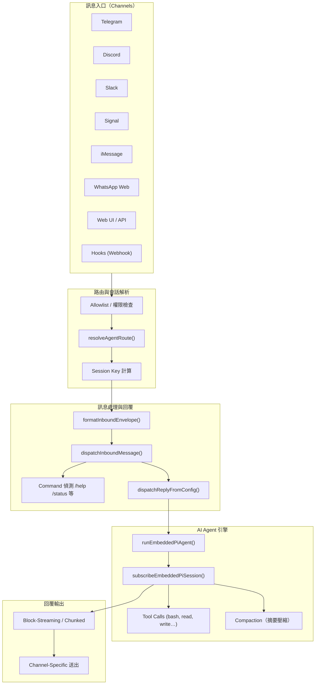
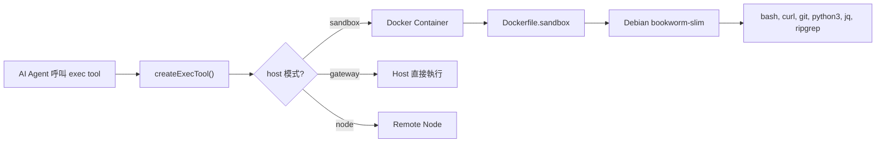

# OpenClaw 專案程式碼架構分析

## 1. 訊息處理完整流程



### 流程步驟說明

| 階段 | 核心檔案 | 說明 |
|------|----------|------|
| **① Channel 接收** | `src/telegram/`, `src/discord/`, `src/slack/`, `src/signal/`, `src/web/` | 各 channel adapter 監聽平台 API/Webhook，收到訊息後建構統一的 `MsgContext` |
| **② 權限檢查** | [allow-from.ts](file:///D:/_Code/_GitHub/openclaw-260224/src/channels/allow-from.ts), [channel-config.ts](file:///D:/_Code/_GitHub/openclaw-260224/src/channels/channel-config.ts) | 比對 `allowFrom` 白名單，決定是否接受此訊息 |
| **③ 路由解析** | [resolve-route.ts](file:///D:/_Code/_GitHub/openclaw-260224/src/routing/resolve-route.ts) | `resolveAgentRoute()` 根據 channel、accountId、peer 等資訊，透過 `bindings` 設定決定路由到哪個 Agent |
| **④ Session Key** | [session-key.ts](file:///D:/_Code/_GitHub/openclaw-260224/src/routing/session-key.ts) | 產生唯一的 session key（`agent:channel:account:peer` 格式），用於隔離對話歷史 |
| **⑤ Envelope 封裝** | [envelope.ts](file:///D:/_Code/_GitHub/openclaw-260224/src/auto-reply/envelope.ts) | `formatInboundEnvelope()` 將訊息包裝為 `[Channel From Timestamp] Body` 格式，作為 AI 的輸入 |
| **⑥ Dispatch** | [dispatch.ts](file:///D:/_Code/_GitHub/openclaw-260224/src/auto-reply/dispatch.ts) | `dispatchInboundMessage()` 協調整個 inbound 處理流程 |
| **⑦ Command 偵測** | `src/auto-reply/command-detection.ts`, `commands-registry.ts` | 檢查是否為 `/help`, `/status`, `/model` 等內建指令 |
| **⑧ AI Agent 執行** | [run.js](file:///D:/_Code/_GitHub/openclaw-260224/src/agents/pi-embedded-runner) (barrel: `pi-embedded-runner.ts`) | `runEmbeddedPiAgent()` 呼叫 LLM API (Claude/GPT/Gemini 等)，傳入 system prompt + 歷史對話 |
| **⑨ Tool Calls** | [bash-tools.exec.ts](file:///D:/_Code/_GitHub/openclaw-260224/src/agents/bash-tools.exec.ts), [pi-tools.ts](file:///D:/_Code/_GitHub/openclaw-260224/src/agents/pi-tools.ts) | AI 可呼叫 `exec` (執行指令)、`read_file`、`write_file` 等工具 |
| **⑩ 回覆串流** | [pi-embedded-subscribe.ts](file:///D:/_Code/_GitHub/openclaw-260224/src/agents/pi-embedded-subscribe.ts) | `subscribeEmbeddedPiSession()` 負責串流處理 AI 的回覆文本，含 Block-Streaming 切割邏輯 |
| **⑪ Channel 送出** | [dock.ts](file:///D:/_Code/_GitHub/openclaw-260224/src/channels/dock.ts) | 根據各 channel 的 `textChunkLimit` 切割訊息後送出 |

---

## 2. 在 Sandbox 中執行指令

### 核心概念

Sandbox 是一個 **Docker 容器**，用於隔離 AI Agent 執行 shell 指令時的環境，避免影響 host 系統。



### 運作機制

| 面向 | 說明 |
|------|------|
| **鏡像** | 基於 [Dockerfile.sandbox](file:///D:/_Code/_GitHub/openclaw-260224/Dockerfile.sandbox)，使用 `debian:bookworm-slim`，預裝 bash/curl/git/python3/jq/ripgrep |
| **Browser Sandbox** | [Dockerfile.sandbox-browser](file:///D:/_Code/_GitHub/openclaw-260224/Dockerfile.sandbox-browser) 額外提供瀏覽器自動化能力 |
| **容器管理** | [sandbox/docker.ts](file:///D:/_Code/_GitHub/openclaw-260224/src/agents/sandbox/docker.ts) 的 `ensureSandboxContainer()` 負責建立/啟動/重用容器 |
| **Config Hash** | 配置變更時自動偵測 hash 不同，重建容器（`computeSandboxConfigHash()`） |
| **Workspace 掛載** | 透過 Docker bind mount 將 workspace 目錄掛載進容器，使 AI 能讀寫檔案 |
| **指令執行** | `docker exec` 在容器內執行 AI 的 shell 指令（`runExecProcess()` in [bash-tools.exec-runtime.ts](file:///D:/_Code/_GitHub/openclaw-260224/src/agents/bash-tools.exec-runtime.ts)） |
| **安全策略** | [sandbox-tool-policy.ts](file:///D:/_Code/_GitHub/openclaw-260224/src/agents/sandbox-tool-policy.ts) 控制 sandbox 模式下的 tool 權限 |
| **Scope 粒度** | sandbox 可按 `per-session` 或 `per-agent` 隔離（`resolveSandboxScope()`） |

### 指令執行的三種 Host 模式

1. **`sandbox`** — 在 Docker 容器中執行（最安全）
2. **`gateway`** — 在 gateway 主機上直接執行（需 allowlist/approval）
3. **`node`** — 遠端 node 上執行

---

## 3. 為何有時候沒有回應？

根據程式碼分析，以下是可能導致無回應的原因：

### 3.1 權限被拒

```
src/channels/allow-from.ts → allowFrom 白名單不匹配
src/channels/mention-gating.ts → 群組中未 @mention bot
src/channels/command-gating.ts → 指令權限不足
```

> [!IMPORTANT]
> 若 `allowFrom` 未包含發送者，訊息會被靜默丟棄，不會有任何回覆。

### 3.2 AI 回覆被抑制

- **`SILENT_REPLY_TOKEN`** — AI 回覆 `[SILENT]` 時，系統會抑制回覆（[tokens.ts](file:///D:/_Code/_GitHub/openclaw-260224/src/auto-reply/tokens.ts) 中的 `isSilentReplyText()`）
- **Heartbeat 隱藏** — `shouldHideHeartbeatChatOutput()` 判定為 heartbeat ACK 時不顯示

### 3.3 路由找不到 Agent

- `resolveAgentRoute()` 無法匹配到任何 binding 或 default agent → 訊息不被處理

### 3.4 LLM API 錯誤/逾時

- API key 失效、quota 用盡、網路超時 → `pi-embedded-runner` 的 `failover-error.ts` 處理錯誤時可能沉默
- **Billing Error** — `isbillingerrormessage` 檢測到計費問題
- **Auth Profile Rotation** — 所有 auth profile 都 cooldown → 無法發起 API 呼叫

### 3.5 指令執行 Approval 超時

- 在 `host=gateway` 模式下，需要人工 approval 的指令若超時（`DEFAULT_APPROVAL_TIMEOUT_MS = 120s`），執行會被拒絕
- 回覆只會顯示 "Approval required"，後續結果依賴非同步通知

### 3.6 Session Write Lock 衝突

- [session-write-lock.ts](file:///D:/_Code/_GitHub/openclaw-260224/src/agents/session-write-lock.ts) — 同一 session 的並行寫入會排隊，可能導致延遲

### 3.7 Compaction 失敗

- 對話歷史過長觸發 compaction（摘要壓縮），如果 compaction 失敗多次重試，會延遲或中斷回覆

### 3.8 Debounce 機制

- [inbound-debounce.ts](file:///D:/_Code/_GitHub/openclaw-260224/src/auto-reply/inbound-debounce.ts) — 快速連續訊息會被合併/去重，某些訊息可能看似「沒有回應」

---

## 4. Windows 與 Linux 環境差異

### 4.1 Shell 與指令執行

| 差異項目 | Windows | Linux/macOS |
|---------|---------|-------------|
| **PTY EOF** | `\x1a` (Ctrl+Z) | `\x04` (Ctrl+D) |
| **行程樹 Kill** | `taskkill /T /F /PID` | `kill -SIGTERM` + process group |
| **Detached 行程** | 不支援 `detached: true` | 使用 `setsid` 建立新 session |
| **Shell 路徑** | 使用 `PATHEXT` 環境變數 | 無需 |
| **指令封裝** | 可能需要 `.cmd`/`.bat` 副檔名 | 直接執行 |

> 關鍵程式碼：[child.ts](file:///D:/_Code/_GitHub/openclaw-260224/src/process/supervisor/adapters/child.ts), [pty.ts](file:///D:/_Code/_GitHub/openclaw-260224/src/process/supervisor/adapters/pty.ts), [kill-tree.ts](file:///D:/_Code/_GitHub/openclaw-260224/src/process/kill-tree.ts)

### 4.2 Sandbox (Docker)

| 項目 | 說明 |
|------|------|
| **Linux** | Docker 原生執行，sandbox 功能完整可用 |
| **Windows** | 需要 Docker Desktop (WSL2 backend)，bind mount 路徑需要跨平台轉換 |
| **macOS** | Docker Desktop，效能開銷較大但功能正常 |

### 4.3 檔案路徑與安全

- Windows 使用 `path.win32.basename()` 處理路徑（[invoke.ts](file:///D:/_Code/_GitHub/openclaw-260224/src/node-host/invoke.ts)）
- Windows 上 symlink 用 `junction` 取代 `dir` 模式
- 檔案權限審計（`audit-fs.ts`）在 Windows 上有不同的邏輯（Windows 不支援 POSIX 權限位元）
- 路徑比較在 Windows 上需要 `toLowerCase()`（case-insensitive filesystem）

### 4.4 記憶體搜尋（QMD）

- Linux/macOS 使用 `chmod` 設定記憶體資料庫檔案權限
- Windows 上跳過 `chmod`（[qmd-manager.ts](file:///D:/_Code/_GitHub/openclaw-260224/src/memory/qmd-manager.ts)）
- Windows 資料目錄使用 `LOCALAPPDATA`，Linux/macOS 使用 `$HOME/.local/share`

### 4.5 測試超時

Windows 上測試超時普遍設定為 Linux 的 **1.5~2 倍**，代表 Windows 環境的行程管理開銷較大。例如：

```typescript
// 典型的 Windows 超時調整
const TIMEOUT_MS = process.platform === "win32" ? 180_000 : 150_000;
```

### 4.6 TUI (Terminal UI)

- [tui.ts](file:///D:/_Code/_GitHub/openclaw-260224/src/tui/tui.ts) — Windows 上略過某些終端控制序列（ANSI escape 相容性問題）

### 4.7 CLI 入口

- [entry.ts](file:///D:/_Code/_GitHub/openclaw-260224/src/entry.ts) 使用 `normalizeWindowsArgv()` 處理 Windows 特有的命令列參數問題
